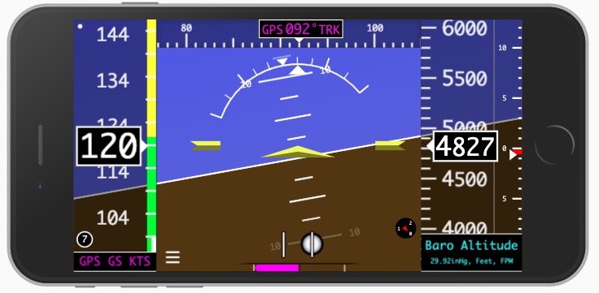

 [](https://github.com/knicholson32/stratux_ahrs/blob/master/LICENSE) [](https://github.com/knicholson32/stratux_ahrs/issues) 

# stratux_ahrs
AHRS Display for the Raspberry pi powered Stratux software.


Extension to the [Stratux](https://github.com/cyoung/stratux) project that allows a browser to be used to display AHRS information. Modeled visually after the [Garmin G5](https://buy.garmin.com/en-US/US/p/570665).

#### <a href="https://knicholson32.github.io/stratux_ahrs/?simulate=true" target="_blank">View an online demo here</a>

### Example Screenshot
This example image was created using simulated data, and shows all visual features of the device.




### Installation:
"stratux_ahrs" is simply a webpage that needs to be copied to the Raspberry pi's /var/www folder. If you can connect the Raspberry Pi to an ethernet internet connection, follow the instructions below. If internet on the Raspberry Pi is not available, clone the repository on a laptop and SFTP the files per the [Wiki](https://github.com/knicholson32/stratux_ahrs/wiki/Installation)

- Connect the Raspberry pi with Stratux on it to internet via the ethernet jack. Also connect your computer to the stratux wifi network that is created.
- [Login to the pi using ssh](https://github.com/cyoung/stratux/wiki/SSH-into-Stratux): (Password should be 'raspberry')
```unix
ssh 192.168.10.1 -l pi
```
- Refresh ethernet interface: (Password should be 'raspberry')
```unix
sudo ifdown eth0
sudo ifup eth0
```
- CD and make the proper directory:
```unix
cd /var/www/
```
- Clone this repository:
```unix
git clone https://github.com/knicholson32/stratux_ahrs.git ahrs
```
_If you get a warning about server verification failure, check the time setting:_
```unix
date -R
```
_If it is incorrect, set using the following and try to clone again:_
```unix
sudo date -s "Jun 24 2018 13:20:12" # <Replace with the new date/time (to the second)>
```
_Alternatively, if setting the time does not work, clone using this command to disable SSL verification (**as a last resort!**):_
```unix
git -c http.sslVerify=false clone https://github.com/knicholson32/stratux_ahrs.git ahrs
```
- Check that the files have been added to the ahrs folder:
```unix
ls ahrs
```
- Shutdown pi:
```unix
sudo shutdown –h now
```
- Install pi back in aircraft!
- Visit _192.168.10.1/ahrs_ on your iPhone in Safari when connected to stratux wifi.
- [Save an icon to the home screen](http://www.knowyourmobile.com/apple/iphone-4/15554/user-guide-how-save-websites-desktop-icons-your-iphone-4s).

## Usage
Ensure you are connected to the "stratux" wifi network and navigate to _192.168.10.1/ahrs_.

Once the page opens, add the page to your home screen for ease of access (procedure varies for each device).

For more details, refer to the [wiki](https://github.com/knicholson32/stratux_ahrs/wiki) for this project.

# Disclamer
This display uses data directly from stratux. As a result, I'll quote [cyoung](https://github.com/cyoung/stratux/wiki/All-About-AHRS) (the creater of stratux):

>"This AHRS will not save your life.

>I was partially motivated to develop this software due to losing my vacuum pump-driven attitude indicator system (including standby pump within an hour each time!) no less than three times over the course of 2700 hours of flying. The last time, at night over the Egyptian Saharan desert, I at least had a clear sky above (there was oftentimes not a single light in the desert below). My autopilot was also driven by the attitude indicator, so I had to both keep upright and hand-fly through the pitch black for hours.

>Fortunately, this last time I also had a MidCon LifeSaver electrical backup. Even surrounded by inky blackness above and below, with no horizon visible outside, between the stars above and the MidCon certified backup, I was able to continue without any loss of situational awareness. However, the thought crossed my mind many times as I flew on through the dark for hours that the MidCon was my last and only backup. If I had to do an instrument approach, I would be partial panel. I would really have loved to have had at least one potential additional and fully independent backup system, if only to provide me some comfort and an independent check for my partial panel flying.

>It goes without saying that a self-built attitude indicator system that can potentially be thrown willy nilly up on the glareshield, in a severely uncontrolled environment, and running software that has never been certified by any independent agent should not be relied upon in any but the most dire of circumstances. Even then, you would be very wise to fly partial panel on certified instruments and use any such system as this only as a cross-reference.

>If this software ever serves just to provide some comfort to a pilot in an event such as I experienced, it will have served its purpose. Its purpose is not to save your life."

I would like to further add that this display is not perfect, and is under development. It may disconnect unexpectedly, causing invalid data to be displayed. Use of this display in life threatening situations is seriously cautioned, and this display is in no way intended to be relied on or override data coming from certified equipment. Please use at your own risk.
